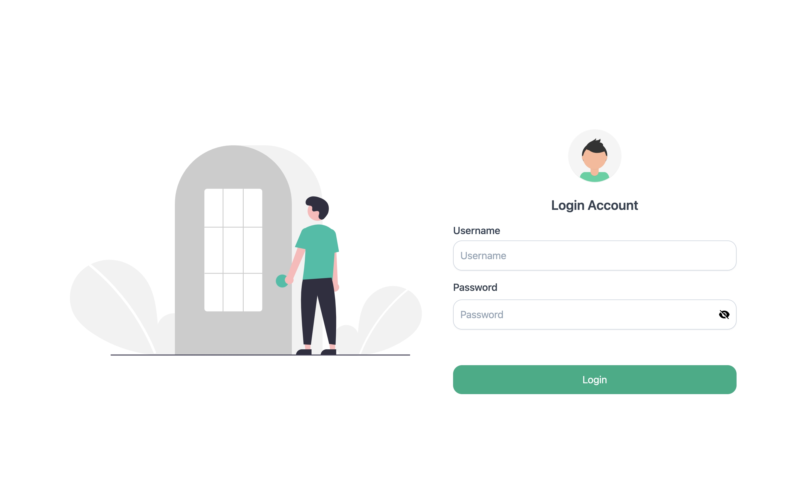

# ApartEase-Frontend

This template should help get you started developing with Vue 3 in Vite.

## Recommended IDE Setup

[VSCode](https://code.visualstudio.com/) + [Volar](https://marketplace.visualstudio.com/items?itemName=Vue.volar) (and disable Vetur).

## Customize configuration

See [Vite Configuration Reference](https://vitejs.dev/config/).

## Project Setup

```sh
npm install
```

### Compile and Hot-Reload for Development

```sh
npm run dev
```

### Compile and Minify for Production

```sh
npm run build
```


# Git Command Line Cheat Sheet

```sh
## Create Repository
mkdir new-repository

## Create File
touch filename.txt

# Commit Changes
git add . && git commit -m "Your commit message"

# Push the File to the Remote Repository
git add filename.txt && git commit -m "Add filename.txt" && git push origin branch-name

# Pull the File from the Remote Repository
git pull origin branch-name

# Checkout or Switch Branch
git checkout branch-name
or
git switch branch-name

# View Branches
git branch

# View Tags
git tag

# Create Branch
git branch new-branch

# Create Tag
git tag v1.0.0

# Merge to dev Branch
git checkout dev && git merge branch-name

# Push Tag to Remote Repository
git push origin v1.0.0

# Rename Branch
git branch -m old-branch-name new-branch-name

# Rename Tag
# Git does not support renaming tags directly. You need to create a new tag and delete the old one:

git tag new-tag old-tag && git tag -d old-tag && git push origin :refs/tags/old-tag && git push origin --tags

# Rename or Update Name of File
git mv old-filename.txt new-filename.txt

# Delete File
git rm filename.txt

# Delete Branch
git branch -d branch-name

# Delete Tag
git tag -d v1.0.0

```


## Project Documentation

### Project Overview
[Click here to view Project Overview](./Project_Docs/overview.jpg)

### UI Design


#### Login Page



#### Signup Page


#### Home page


#### Profile Page


#### Resident Page


#### Resident Create Modal


#### Resident Update Modal

#### User Page


#### User Create Modal


#### User Update Modal

#### Role Page


#### Role Create Modal


#### Role Update Modal


#### Delete Modal


#### Unit Management Page


#### Unit Update Modal


#### Bill Page


#### Bill History


#### Bill History View Modal


#### Upload Page


